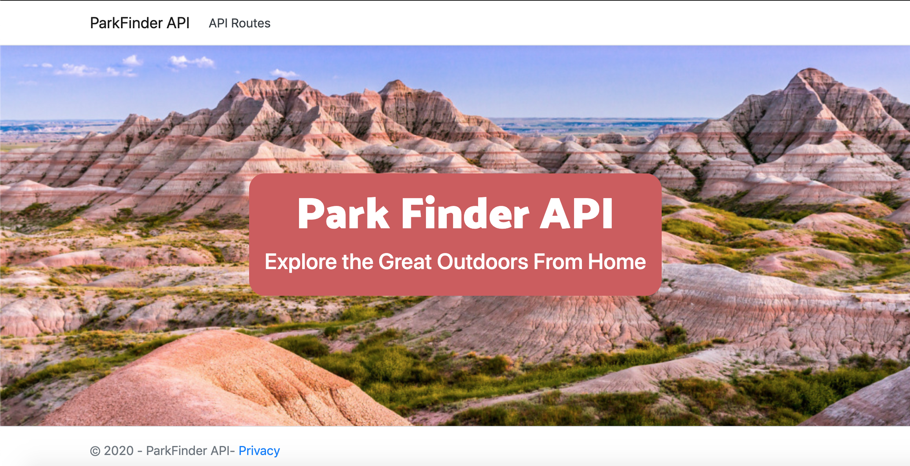

# _Park Finder API_

#### By _**K. Wicz**_


## Description

_An ASP.NET Core Web API that allows users to access data about the United States National Parks._

## Preview



## Setup/Installation Requirements

### 1.  Install .NET Core

#### on macOS:
* [Click here](https://dotnet.microsoft.com/download/thank-you/dotnet-sdk-2.2.106-macos-x64-installer) to download a .NET Core SDK from Microsoft Corp.

#### on Windows:
* [Click here](https://dotnet.microsoft.com/download/thank-you/dotnet-sdk-2.2.203-windows-x64-installer) to download the 64-bit .NET Core SDK from Microsoft Corp.

#### Install dotnet script
Enter the command ``dotnet tool install -g dotnet-script`` in Terminal (macOS) or PowerShell (Windows).

### 2. Clone this repository

Enter the following commands in Terminal (macOS) or PowerShell (Windows):
```sh
cd desktop
git clone https://github.com/kwicz/ParkFinder.Solution
cd ParkFinder.Solution
```
### 3. Install all necessary packages and make sure the project will build
In your terminal, type the following commands to make sure all necessary packages are included in the project and to launch in your browser:
```sh
cd ParkFinder
dotnet restore
dotnet build
```

### 4. Update the database and tables
Enter the following to update your database and tables for the program:
```sh
dotnet ef database update
```

### 5. Launch the project in your browser
In your terminal, type:
```sh
dotnet watch run
```
Hold ```command``` while clicking the link in your local terminal to your local address, which should be:
```sh
http://127.0.0.1:5000
```

## Seed National Park Data (Optional)

1. Open MySQL WorkBench.
2. Navigate to the `Schema` tab.
3. Right click on `k_wicz` and select `Table Data Import Wizard`.
4. Select `nationalParks.utf8.csv` from the root directory of the project and click `Next`.
5. Select `Use existing table` and from the drop down, select `k_wicz.parks`.  Click `Next`.
6. Confirm the data is correct and click `Next`.
7. Confirm executing the import.
8. Congratulations! You have a filled `parks` table that you can now query.

## Park Finder API Endpoints
_Once you have installed this program, you can use these endpoints on your local host in your browser._

Base URL: ```https://localhost:5000```

#### HTTP Requests
```sh
GET /api/parks
POST /api/parks
GET /api/parks/{id}
PUT /api/parks/{id}
DELETE /api/parks/{id}
```
#### Path Parameters
| Parameter | Type | Description |
| :---: | :---: | --- |
| name | string | Returns matches by park name.
| location | string | Returns all parks in specified location. |
| dateEstablished | string | Returns all parks established on specified date. |
| area | string | Returns all parks with specifed area. |
| description | string | Returns all parks with specified description. |

#### Example Query
```sh
https://localhost:5000/api/parks/?name=Epicodus&location=Portland&dateEstablished=January%201%2C%202010
```
#### Further API Exploration

_You can explore these endpoints further after downloading this repo and exploring this API's [Swagger Documentation](https://localhost:5001/swagger/index.html)._

## Known Bugs

_No known bugs at this time._

## Support and contact details

_Have a bug or an issue with this application? [Open a new issue](https://github.com/kwicz/ParkFinder.Solution/issues) here on GitHub._

## Technologies Used
* _C#_
* _.NET Core 2.2_
* _ASP.NET Core MVC_
* _MySQL 2.2.0_
* _MySQL Workbench 8.0_
* _EF Core 2.2.0_
* _Razor 2.2.0_
* _Swashbuckle 5.0.0_
* _[Badlands Photography by Andreas Eckert](https://www.doi.gov/blog/10-things-you-didnt-know-about-badlands-national-park)_
* _National Parks CSV from [Download Excel Files](https://www.downloadexcelfiles.com/us_en/download-excel-file-list-national-parks-us)_

## License

[MIT License](https://choosealicense.com/licenses/mit/)

Copyright (c) 2020 **_K Wicz_**